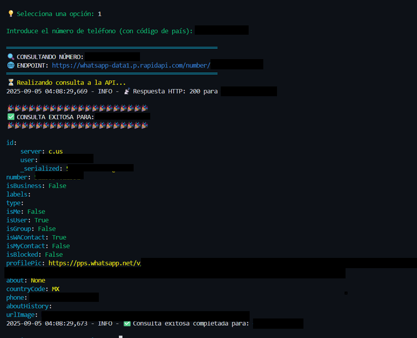

# WhatSPY - WhatsApp Number Intelligence Tool

<div align="center">



[](https://www.python.org/downloads/)
[](LICENSE)
[](https://rapidapi.com/)
[]()

**Herramienta para consultar información de números de WhatsApp a través de API**

</div>

## Características

- Consulta información detallada de números de WhatsApp
- Validación automática de formato de números telefónicos
- Interfaz de terminal con colores
- Exportación automática de resultados en JSON
- Sistema de logging completo
- Manejo robusto de errores de red
- Compatible con Windows, macOS y Linux

## Instalación

### Requisitos

- Python 3.8+
- Clave de API de RapidAPI
- Conexión a internet

### Pasos

1. **Clonar el repositorio**
```bash
git clone https://github.com/B4sal/whatS.PY.git
cd whatS.PY
```

2. **Instalar requirements**
```bash
pip install -r requirements.txt
```

3. **Obtener API Key**

- Ve a [WhatsApp Data1 API](https://rapidapi.com/airaudoeduardo/api/whatsapp-data1)
- Registrate en RapidAPI si no tienes cuenta
- Suscríbete a la API "WhatsApp Data1"
- Copia tu API Key desde el dashboard

4. **Configurar variables de entorno**

```bash
# Crear archivo de configuración
cp .env.example .env

# Editar .env con tus datos:
RAPIDAPI_KEY=tu_clave_api_aqui
RAPIDAPI_HOST=whatsapp-data1.p.rapidapi.com
```

## Uso

### Ejecutar el programa

```bash
python whatS.py
```

### Menú principal

```
MENÚ PRINCIPAL

1. Consultar número de WhatsApp
2. Consultar y guardar resultado
3. Ver logs del sistema
4. Limpiar pantalla
5. Ver ayuda y documentación

0. Salir del programa
```

### Formatos de número soportados

```
+52 55 1234 5678    # Con código de país
+1 555 123 4567     # Estados Unidos  
+34 612 345 678     # España
5215512345678       # Sin espacios
(555) 123-4567      # Con paréntesis
```

## Dependencias

```
requests>=2.28.0     # HTTP requests
python-dotenv>=0.19.0 # Variables de entorno  
colorama>=0.4.4      # Terminal colors
```

## Estructura del proyecto

```
whatS.PY/
├── whatS.py           # Script principal
├── requirements.txt   # Dependencias
├── .env.example       # Configuración ejemplo
├── README.md          # Esta documentación
├── LICENSE           # Licencia MIT
├── whatSPY.log       # Logs generados
└── img/              # Imágenes
    ├── Demo.png
    └── WhatsappData_API.png
```

## Archivos generados

**whatSPY.log**
- Registro de todas las operaciones
- Se actualiza automáticamente

**whatsapp_data_*.json**  
- Resultados de consultas
- Formato: `whatsapp_data_{numero}_{timestamp}.json`

## Configuración

### Variables de entorno requeridas

| Variable | Descripción | Ejemplo |
|----------|-------------|---------|
| `RAPIDAPI_KEY` | Tu clave de API | `abcd1234...` |
| `RAPIDAPI_HOST` | Host de la API | `whatsapp-data1.p.rapidapi.com` |

### Personalización

Puedes modificar estas constantes en `whatS.py`:

```python
API_TIMEOUT: int = 30         # Timeout requests
LOG_FILE: str = 'whatSPY.log' # Archivo de logs
MAX_LOG_LINES: int = 20       # Líneas mostradas
MIN_PHONE_LENGTH: int = 10    # Longitud mínima
MAX_PHONE_LENGTH: int = 15    # Longitud máxima
```

## Troubleshooting

**Error: Variables de entorno no encontradas**
```
Error cargando variables de entorno: Las variables RAPIDAPI_KEY y RAPIDAPI_HOST son requeridas.
```
Solución: Verifica que existe el archivo `.env` con las variables correctas.

**Error: Número inválido**  
```
Número de teléfono inválido. Verifica el formato.
```
Solución: Incluye el código de país en el número.

**Error: Timeout**
```
Timeout: La consulta tardó más de 30 segundos
```
Solución: Revisa tu conexión a internet.

## Detalles técnicos

- Arquitectura orientada a objetos
- Validación de números según estándar E.164  
- Logging con múltiples niveles
- Interfaz colorida usando Colorama
- Compatible con Python 3.8+ 
- Integración con RapidAPI

## Contribuir

1. Fork el proyecto
2. Crea tu branch (`git checkout -b feature/nueva-feature`)
3. Commit tus cambios (`git commit -m 'Agregar nueva feature'`)
4. Push al branch (`git push origin feature/nueva-feature`)
5. Abre un Pull Request

## Licencia

Este proyecto usa la licencia MIT. Ver [LICENSE](LICENSE) para detalles.

## Autor

**B4sal**
- GitHub: [@B4sal](https://github.com/B4sal)
- Proyecto: [whatS.PY](https://github.com/B4sal/whatS.PY)

---

<div align="center">

Si este proyecto te sirve, dale una estrella ⭐

</div>